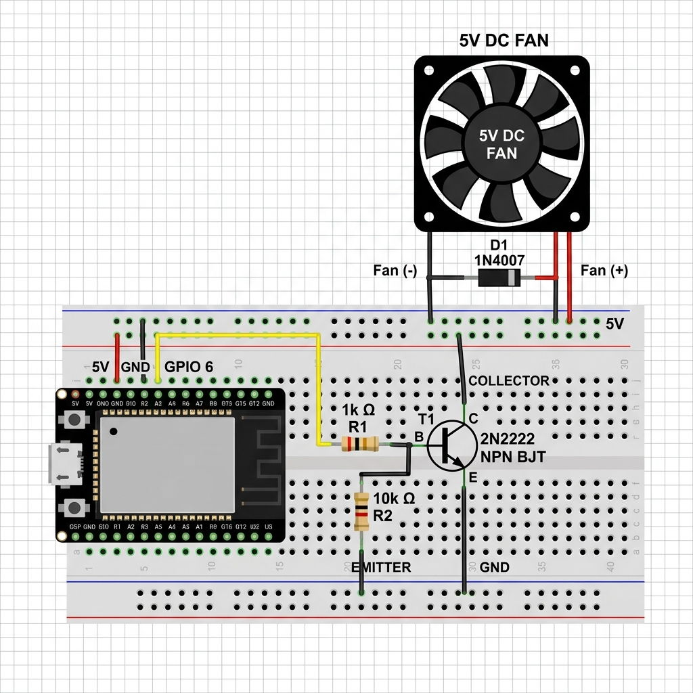

# Hướng dẫn chi tiết đấu nối phần cứng hệ thống Smart Home với ESP32-S3

Tài liệu này cung cấp sơ đồ, nguyên lý hoạt động và các lưu ý kỹ thuật chi tiết khi cắm mạch thực tế trên breadboard sử dụng vi điều khiển **ESP32-S3** để điều khiển 3 Đèn LED, 2 Động cơ DC (Quạt) và 1 Động cơ Servo (Cửa chính) với cấu hình chân an toàn mới để tránh xung đột chân nhớ.

---

## 1. Sơ đồ mạch tổng quan (Nguyên lý Breadboard)

```
                            +-------------------+
                            |     ESP32-S3      |
                            |                   |
                            |    5V (VBUS)  GND |
                            +----+-----------+--+
                                 |           |
       +-------------------------+           +------------------+
       | (Nguồn 5V chung)                                       | (Đất GND chung)
       V                                                        V
  =====[ ĐƯỜNG DƯƠNG NGUỒN BREADBOARD ]=====               =====[ ĐƯỜNG ĐẤT BREADBOARD ]=====
       |               |               |                        |       |       |       |
       |               |               |                        |       |       |       |
  +----+----+     +----+----+     +----+----+                   |       |       |       |
  |  Servo  |     | Quạt 5V |     |   Tụ    |                   |       |       |       |
  |  (Đỏ)   |     |  (Đỏ)   |     |  Lọc    |                   |       |       |       |
  +---------+     +----+----+     |  (+)    |                   |       |       |       |
                       |          +----+----+                   |       |       |       |
                       |               |                        |       |       |       |
                       |               +------------------------+       |       |       |
                       | (Flyback                                       |       |       |
                       |  Diode)                                        |       |       |
                       +======[|<]======+                               |       |       |
                       | (Cathode-Anode)|                               |       |       |
                       V                |                               |       |       |
                  +----+----+           |                               |       |       |
                  |Transistor|          |                               |       |       |
                  |Collector|           |                               |       |       |
                  +----+----+           |                               |       |       |
                       |                |                               |       |       |
                       | (Emitter)      |                               |       |       |
                       +------------------------------------------------+       |       |
                                                                                |       |
                                                     +==========[ 220 Ohm ]=====+       |
                                                     | (Điện trở hạn dòng LED)          |
                                                     V                                  |
                                                +----+----+                             |
                                                |   LED   |                             |
                                                | (Anode) |                             |
                                                +----+----+                             |
                                                     | (Cathode)                        |
                                                     +----------------------------------+
```

---

## 2. Chi tiết đấu nối từng khối linh kiện

### Khối 1: Đèn chiếu sáng (3 Đèn LED)
*   **Linh kiện**: 03 x LED thường, 03 x Điện trở $220\Omega$ (hoặc $330\Omega$).
*   **Cách nối dây**:
    1. Cắm chân **Anode (chân dài hơn, hình tam giác bên trong nhỏ)** của mỗi LED vào một lỗ trên breadboard.
    2. Cắm chân **Cathode (chân ngắn hơn, có vát phẳng ở vỏ nhựa)** của các LED vào đường **GND chung** của breadboard.
    3. Nối một đầu điện trở $220\Omega$ vào chân Anode của mỗi LED.
    4. Nối đầu còn lại của các điện trở $220\Omega$ vào các chân điều khiển tương ứng trên ESP32-S3:
       - **Đèn phòng khách**: Nối vào chân **GPIO 4**.
       - **Đèn phòng ngủ**: Nối vào chân **GPIO 5**.
       - **Đèn nhà bếp**: Nối vào chân **GPIO 6**.
*   **Nguyên lý kỹ thuật**: Điện trở $220\Omega$ đóng vai trò hạn chế dòng điện chạy qua LED ở mức khoảng $10\text{mA} - 15\text{mA}$ để tránh làm cháy LED hoặc làm hỏng bán dẫn bên trong chân GPIO của chip ESP32-S3.

---

### Khối 2: Cửa chính (Động cơ Servo SG90 / MG90S)
*   **Linh kiện**: 01 x Servo SG90 (hoặc MG90S), 01 x Tụ hóa lọc nguồn $100\mu\text{F} - 470\mu\text{F}$ (tùy chọn nhưng khuyên dùng).
*   **Cách nối dây**:
    1. Dây màu **Đỏ (VCC)**: Nối trực tiếp vào chân **5V (hoặc VBUS)** của ESP32-S3.
    2. Dây màu **Nâu hoặc Đen (GND)**: Nối vào đường **GND chung** của breadboard.
    3. Dây màu **Cam hoặc Vàng (Signal)**: Nối vào chân **GPIO 13** của ESP32-S3.
    4. *Cải tiến lọc nguồn*: Cắm hai chân của tụ hóa song song với đường nguồn cấp cho Servo (Chân dài hơn/không vạch của tụ nối 5V, chân ngắn/có vạch trắng chỉ dấu trừ `-` của tụ nối GND).
*   **Nguyên lý kỹ thuật**: Servo SG90 cần nguồn áp 5V ổn định để hoạt động. Việc cắm thêm tụ lọc nguồn giúp bù điện áp tức thời này, ngăn chặn hiện tượng sụt áp trên ESP32 gây reset chip đột ngột khi Servo chuyển động.

---

### Khối 3: 2 Quạt gió (Quạt tản nhiệt 5V 0.04A)



*   **Linh kiện**: 02 x Quạt tản nhiệt 5V 0.04A, 02 x Transistor BJT NPN (2N2222 hoặc C1815), 02 x Diode 1N4007, 02 x Điện trở $1k\Omega$, 02 x Điện trở $10k\Omega$.
*   **Cách nối dây (Áp dụng tương tự cho cả 2 quạt)**:
    1. Xác định 3 chân của Transistor NPN **2N2222** (nhìn từ mặt phẳng chứa chữ, từ trái qua phải): **1 - Emitter (E)**, **2 - Base (B)**, **3 - Collector (C)**. 
       *(Lưu ý: Nếu sử dụng Transistor NPN C1815, thứ tự chân sẽ là: 1 - Emitter, 2 - Collector, 3 - Base. Cần kiểm tra kỹ datasheet để cắm chân chính xác)*.
    2. Chân **Base (B - chân 2)**: 
       - Quạt phòng khách: Nối tiếp với một điện trở $1k\Omega$ vào chân **GPIO 11** của ESP32-S3. Nối thêm một điện trở $10k\Omega$ từ chân Base về đường **GND** (trở kéo xuống - pulldown).
       - Quạt phòng ngủ: Nối tiếp với một điện trở $1k\Omega$ vào chân **GPIO 12** của ESP32-S3. Nối thêm một điện trở $10k\Omega$ từ chân Base về đường **GND** (trở kéo xuống - pulldown).
    3. Chân **Collector (C - chân 3)**: Nối vào cực âm (Dây Đen) của quạt tương ứng.
    4. Chân **Emitter (E - chân 1)**: Nối trực tiếp vào đường **GND chung**.
    5. Cực dương (Dây Đỏ) của quạt: Nối vào đường nguồn **5V/VBUS** của ESP32-S3.
    6. Mắc song song Diode **1N4007** với hai cực của mỗi quạt: Đầu có vòng vạch bạc (Cathode) nối vào cực dương/Dây Đỏ (+), đầu không vạch (Anode) nối vào cực âm/Dây Đen (-) / chân Collector của Transistor.
*   **Nguyên lý kỹ thuật**: 
    *   Transistor NPN đóng vai trò là một khóa điện tử trung gian điều khiển băm nguồn 5V thông qua điều rộng xung PWM để điều chỉnh tốc độ quạt.
    *   **Diode 1N4007 (Flyback Diode)** mắc ngược tạo đường xả an toàn cho dòng điện cảm ứng ngược của cuộn dây quạt khi ngắt điện, bảo vệ tiếp giáp Collector-Emitter của Transistor không bị đánh thủng.

---

## 3. Bảng tóm tắt kết nối dây (Quick Reference Pinout)

| Linh kiện | Chân linh kiện | Màu dây | Kết nối với ESP32-S3 / Breadboard |
| :--- | :--- | :--- | :--- |
| **Đèn LED Phòng Khách** | Anode (+) | - | GPIO 4 (Qua điện trở $220\Omega$) |
| **Đèn LED Phòng Ngủ** | Anode (+) | - | GPIO 5 (Qua điện trở $220\Omega$) |
| **Đèn LED Nhà Bếp** | Anode (+) | - | GPIO 6 (Qua điện trở $220\Omega$) |
| **Servo SG90 (Cửa)** | Tín hiệu (Signal) | Vàng / Cam | GPIO 13 |
| | Nguồn (VCC) | Đỏ | 5V / VBUS |
| | Đất (GND) | Nâu / Đen | GND |
| **Quạt Phòng Khách** | Cực dương (+) | Đỏ | 5V / VBUS |
| | Cực âm (-) | Đen | Chân Collector (C) của Transistor 1 |
| **Transistor 1 (Quạt khách)** | Base (B - Chân 2) | - | GPIO 11 (Qua trở $1k\Omega$ & kéo xuống GND bằng trở $10k\Omega$) |
| | Emitter (E - Chân 1)| - | GND |
| **Quạt Phòng Ngủ** | Cực dương (+) | Đỏ | 5V / VBUS |
| | Cực âm (-) | Đen | Chân Collector (C) của Transistor 2 |
| **Transistor 2 (Quạt ngủ)** | Base (B - Chân 2) | - | GPIO 12 (Qua trở $1k\Omega$ & kéo xuống GND bằng trở $10k\Omega$) |
| | Emitter (E - Chân 1)| - | GND |
| **Đất chung** | Tất cả chân GND | - | GND của ESP32-S3 |
